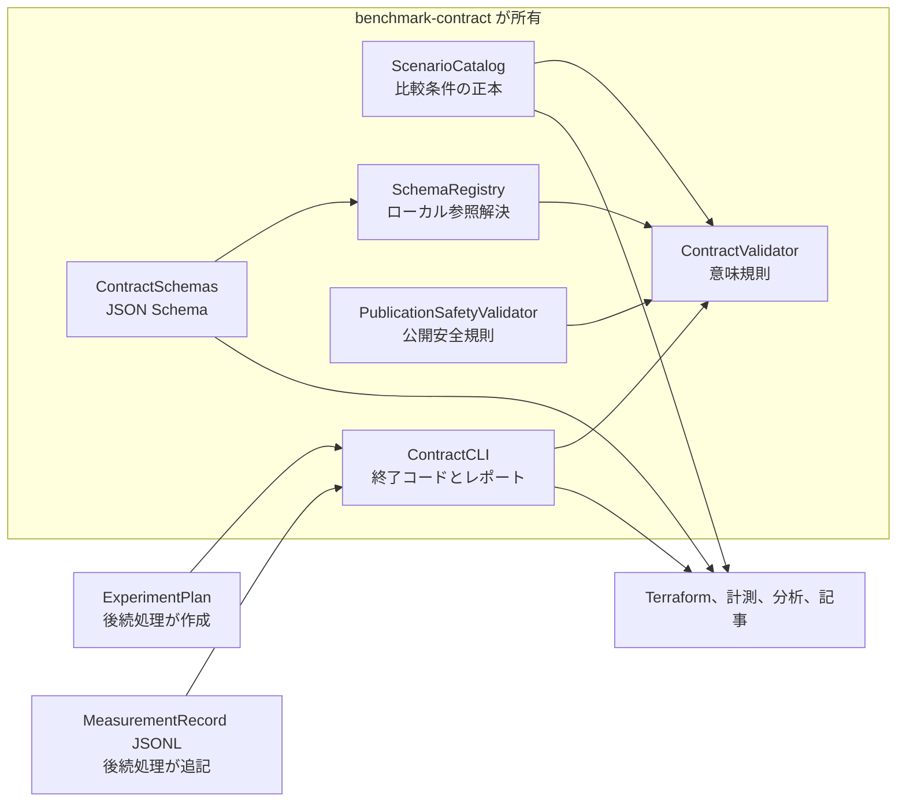
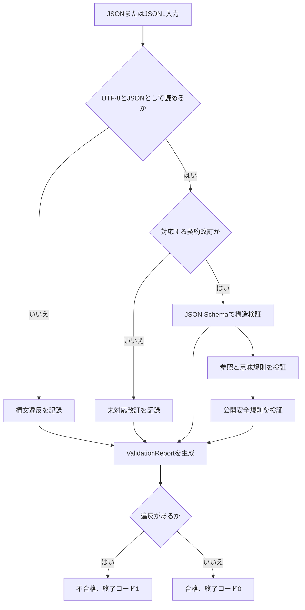
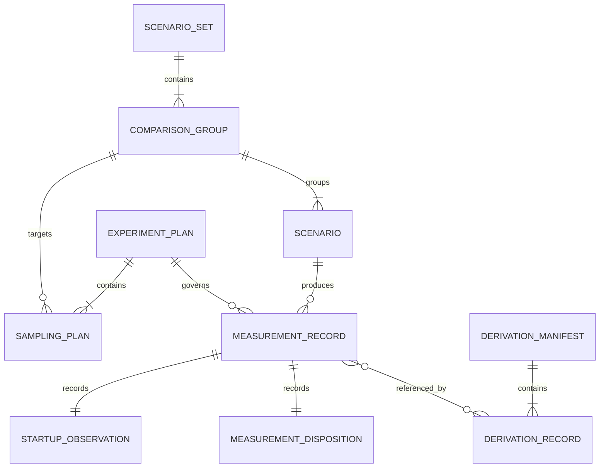

# Design Document

## Overview

`benchmark-contract`は、AWS LambdaのPython版とGo版を比較する実験について、シナリオ、実験計画、一回ごとの測定記録、検証結果を機械検証可能な形で定義する。
リポジトリ管理者、実験実行者、分析者、記事執筆者は、同じ契約改訂を参照して測定値の意味と来歴を確認する。
新たにJSON Schema群、基準となるシナリオ一覧、Python製の検証CLIを追加し、後続仕様が契約違反を黙って補正できない境界を作る。

### Goals

- 比較条件、意図的に変える要因、対象外条件をシナリオ定義として固定する。
- すべての測定試行を追記型のJSON Linesで記録できる契約を定める。
- 起動区分、標本の採否、実験計画変更を再現可能な規則として定める。
- 構造違反、意味規則違反、公開安全違反を一つの検証結果へ列挙する。
- Python、Go、Terraform、分析処理が言語に依存せず同じ契約を参照できるようにする。

### Non-Goals

- Lambda関数、Terraform、AWSリソースを実装しない。
- Lambdaの呼び出し、CloudWatch Logsの取得、ログ解析を実装しない。
- 統計量、グラフ、記事本文を生成しない。
- JSON SchemaからPython型やGo型を自動生成しない。
- 一般用途のスキーマ配布サービスや遠隔参照機構を作らない。

## Boundary Commitments

### This Spec Owns

- JSON Schema Draft 2020-12で記述した契約改訂`1.0.0`のスキーマ群。
- シナリオID、比較グループ、固定条件、変動要因、観測指標、対象外条件の正本。
- 実験計画、計画変更、測定記録、検証レポートのデータ形状。
- 起動区分、標本採否、文書間参照、公開安全性に関する意味検証規則。
- 全違反を列挙し、不合格時に非ゼロで終了するローカルCLI。

### Out of Boundary

- `lambda-benchmark-environment`が所有するLambda関数、ビルド成果物、Terraform設定。
- `measurement-analysis`が所有するAWS呼び出し、CloudWatch待機と再試行、生データ書き込み、集計、可視化。
- `technical-article`が所有する記事本文、図表の説明、公開判断。
- AWS上の認証、権限設定、リソース削除。
- GitHubのRulesetやbranch protectionによるrequired checkの強制設定。
- Gitへの自動コミットや不合格データの自動修正。

### Allowed Dependencies

- JSON Schema Draft 2020-12のCoreとValidation語彙へ依存してよい。
- Python 3.12以上、`jsonschema`、`referencing`、Python標準ライブラリへ依存してよい。
- Python環境と依存版の固定には`uv`を使用してよい。
- AWS SDK、Terraform、Lambdaランタイム、分析ライブラリへ依存してはならない。
- 下流仕様は公開されたJSONファイル、JSON Linesファイル、CLIだけを参照し、Python内部モジュールへ直接依存しない。
- 依存方向は共通型とスキーマ、登録表と公開安全検査、意味検証、CLI、CIの順とし、逆向きの参照を禁止する。

### Revalidation Triggers

- スキーマの必須項目、許容値、識別子、互換性方針を変更したとき。
- シナリオの比較グループ、固定条件、変動要因、期待応答を変更したとき。
- 起動区分、標本採否、公開安全検査の規則を変更したとき。
- `contract_revision`を更新したとき。
- 下流仕様が契約にない項目を必要としたとき。

## Architecture

以下の英語名は実装上の識別子であり、外部製品や標準アーキテクチャの名称ではない。

### Architecture Pattern & Boundary Map

JSON Schemaを正本とし、Pythonを検証アダプターに限定する契約優先の検証パイプラインを採用する。
単一文書の形は`ContractSchemas`が定め、複数文書の関係と公開条件は`ContractValidator`が検証する。



**Architecture Integration**:

- **Selected pattern**: JSON Schema正本と薄い検証アダプターによる直列パイプライン。
- **Domain boundaries**: 契約の定義と検証だけを所有し、AWSへの接続や分析処理を受け持たない。
- **Existing patterns preserved**: `.kiro/specs/`の仕様単位とロードマップの依存順を維持する。
- **New components rationale**: 文書構造、文書間整合性、公開安全性、CLI入出力をそれぞれ一つの責任へ分ける。
- **Steering compliance**: データの事実と分析方針をファイル単位で分け、変更単位ごとの境界を保つ。

### Technology Stack

| Layer | Choice / Version | Role in Feature | Notes |
|---|---|---|---|
| CLI | Python 3.12以上、`argparse` | ローカル検証コマンド | 標準ライブラリを優先する |
| Contract | JSON Schema Draft 2020-12 | 文書構造の正本 | `$id`と`$ref`を使用する |
| Validation | `jsonschema` 4系、`referencing` | 構造検証とローカル参照解決 | `FormatChecker`を明示する |
| Storage | JSON、UTF-8 JSON Lines | 定義、計画、測定記録、レポート | 測定記録は一行一試行とする |
| Dependency management | `uv`、`uv.lock` | 再現可能なPython環境 | `contract/`内で完結する |
| Test | `pytest`、`ruff`、`mypy` | 振る舞い、形式、型の検査 | 開発依存に限定する |
| CI | GitHub Actions | 契約と公開データの合格確認 | 不合格をrequired check用のfailureとして報告する |

## File Structure Plan

### Directory Structure

```text
README.md                              # リポジトリ全体と契約検証への入口
.gitignore                             # Python環境とローカル検証出力の除外
.github/
└── workflows/
    └── validate-contract.yml          # 契約検証のCI
contract/
├── README.md                         # 契約の使い方とCLI例
├── pyproject.toml                    # パッケージ、CLI、検査設定
├── uv.lock                           # 検証環境の固定版
├── schemas/
│   └── v1.0.0/
│       ├── common.schema.json        # 識別子、日時、ダイジェストの共通定義
│       ├── scenario-set.schema.json  # シナリオと比較グループ
│       ├── experiment-plan.schema.json # 事前登録した実験計画
│       ├── measurement-record.schema.json # 一回の測定試行
│       ├── derivation-manifest.schema.json # 派生物と生データの対応
│       └── validation-report.schema.json # CLIの機械可読出力
├── config/
│   └── scenarios.json                # 初回比較の基準シナリオ一覧
├── examples/
│   └── article-plan.json             # 記事用試行計画の記入例
├── src/benchmark_contract/
│   ├── __init__.py                   # 対応契約改訂の公開
│   ├── types.py                      # 検証結果の値型
│   ├── schema_registry.py            # スキーマ読込とローカル参照登録
│   ├── validation.py                 # 構造検証と文書間の意味検証
│   ├── publication_safety.py         # 禁止情報と公開項目の検査
│   └── cli.py                        # 引数、JSON入出力、終了コード
└── tests/
    ├── fixtures/
    │   ├── valid/                    # 契約を満たす最小例と完全例
    │   └── invalid/                  # 違反コードごとの反例
    ├── unit/
    │   ├── test_schema_registry.py
    │   ├── test_validation.py
    │   └── test_publication_safety.py
    └── integration/
        └── test_cli.py
```

### Repository Files

- `.gitignore`は`contract/.venv/`とローカル検証出力を除外する。
- `README.md`は契約検証への入口と後続仕様との関係を案内する。
- `.github/workflows/validate-contract.yml`はスキーマ、基準シナリオ、公開対象データを検証し、不合格をマージ不可の判定として報告する。

後続仕様が作る公開対象の探索パスは`experiments/plans/*.json`、`data/raw/<experiment_id>/<plan_id>.jsonl`、`data/derived/<experiment_id>/manifest.json`に固定する。
この仕様はパスと検証方法を定めるが、実験計画、生データ、派生物の内容と書き込み処理は所有しない。

## System Flows



違反は入力順、JSON Pointer、違反コードの順で安定して並べる。
JSON Linesでは一行の不合格で処理を止めず、読めるすべての行を検査して一つのレポートへ集約する。
不合格入力は書き換えず、元ファイルと行番号を保ったまま下流処理への受け渡しだけを止める。

## Requirements Traceability

| Requirement | Summary | Components | Interfaces | Flows |
|---|---|---|---|---|
| 1.1 | 安定したシナリオID | ContractSchemas、ScenarioCatalog | Scenario | シナリオ検証 |
| 1.2 | 言語、依存区分、期待応答、比較先 | ContractSchemas、ScenarioCatalog | Scenario | シナリオ検証 |
| 1.3 | 意味変更時にIDを再利用しない | ContractValidator、ContractCLI | ScenarioCompatibility | 基準集合との互換性検証 |
| 1.4 | 異なるグループの直接比較を禁止 | ContractValidator | ComparisonGroup | 意味検証 |
| 2.1 | 固定条件、変動要因、指標 | ContractSchemas、ScenarioCatalog | ComparisonGroup | シナリオ検証 |
| 2.2 | グループ共通条件 | ContractValidator | Scenario、ComparisonGroup | 意味検証 |
| 2.3 | 条件不一致を判別 | ContractValidator | MeasurementRecord | 測定記録検証 |
| 2.4 | 対象外条件を明示 | ContractSchemas、ScenarioCatalog | ScenarioSet | シナリオ検証 |
| 3.1 | 全試行を記録 | ContractSchemas | MeasurementRecord | JSON Lines検証 |
| 3.2 | 試行の基本識別情報 | ContractSchemas | MeasurementRecord | 構造検証 |
| 3.3 | 根拠、時間、資源、環境、成果物 | ContractSchemas | MeasurementRecord | 構造検証 |
| 3.4 | 取得済みランタイム版を保存 | ContractValidator | RuntimeEnvironment | 意味検証 |
| 3.5 | 欠落を無効として報告 | ContractSchemas、ContractCLI | RecordValidationResult | 構造検証、レポート生成 |
| 4.1 | 初期化根拠でコールド判定 | ContractValidator | StartupObservation | 意味検証 |
| 4.2 | 再利用根拠でウォーム判定 | ContractValidator | StartupObservation | 意味検証 |
| 4.3 | 欠落または矛盾で判定不能 | ContractValidator | StartupObservation | 意味検証 |
| 4.4 | 失敗を成功から分離 | ContractValidator | ExecutionResult、StartupObservation | 意味検証 |
| 4.5 | 除外条件を事前定義 | ContractSchemas、ContractValidator | ExperimentPlan | 計画検証 |
| 4.6 | 元記録と除外理由を保持 | ContractSchemas | MeasurementDisposition | 測定記録検証 |
| 5.1 | 動作確認と記事用を区別 | ContractSchemas | TrialPhase | 構造検証 |
| 5.2 | 標本数と順序を事前登録 | ContractValidator | ExperimentPlan | 計画検証 |
| 5.3 | グループ内で同数の標本 | ContractValidator | SamplingPlan | 意味検証 |
| 5.4 | 無作為順序を再生成 | ContractValidator | ExecutionOrdering | 意味検証 |
| 5.5 | 計画変更の前後と理由を保持 | ContractSchemas、ContractValidator | PlanAmendment | 計画検証 |
| 6.1 | 生データを上書きしない | ContractValidator、ContractCLI | AppendOnlyComparison | 基準ファイルとの接頭辞検証 |
| 6.2 | 派生物の再生成情報 | ContractSchemas、ContractValidator | DerivationManifest | 派生物契約検証 |
| 6.3 | 採用数、除外数、理由 | ContractSchemas、ContractValidator | ScenarioDerivationSummary | 派生物契約検証 |
| 6.4 | 派生記録から測定記録を参照 | ContractSchemas、ContractValidator | DerivationRecord | 派生物契約検証 |
| 7.1 | 認証情報を禁止 | PublicationSafetyValidator | PublicationSafetyResult | 公開安全検証 |
| 7.2 | AWS固有識別子を別名化 | PublicationSafetyValidator | ResourceAlias | 公開安全検証 |
| 7.3 | 無関係な利用者データを除外 | ContractSchemas、PublicationSafetyValidator | ExecutionResult | 公開安全検証 |
| 7.4 | 不合格データの追加を阻止 | ContractCLI | ExitStatus | レポート生成 |
| 8.1 | 合否と全違反を出力 | ContractValidator、ContractCLI | ValidationReport | レポート生成 |
| 8.2 | 未対応改訂を拒否 | SchemaRegistry、ContractValidator | ContractRevision | 改訂検証 |
| 8.3 | 合格時にグループと改訂を特定 | ContractValidator | RecordValidationResult | レポート生成 |
| 8.4 | 違反時は不合格 | ContractCLI | ExitStatus | レポート生成 |

## Components and Interfaces

| Component | Domain/Layer | Intent | Req Coverage | Key Dependencies | Contracts |
|---|---|---|---|---|---|
| ContractSchemas | 契約 | 単一文書の形と値制約を定める | 1.1、1.2、2.1、2.4、3、4.5、4.6、5、6.2、6.3、6.4、7.3、8.1 | JSON Schema Draft 2020-12 | Data |
| ScenarioCatalog | 契約データ | 初回比較条件の正本を提供する | 1、2 | ContractSchemas | State |
| SchemaRegistry | アダプター | 対応改訂のスキーマをローカルで解決する | 8.2 | ContractSchemas、referencing | Service |
| ContractValidator | ドメイン | 構造と文書間の意味規則を検査する | 1.3、1.4、2.2、2.3、3.4、4、5、6、8 | SchemaRegistry、ScenarioCatalog | Service、Batch |
| PublicationSafetyValidator | ドメイン | 公開禁止情報と別名規則を検査する | 7 | ContractSchemas | Service |
| ContractCLI | CLI | ファイル入出力、互換性確認、全違反の集約、終了コードを提供する | 1.3、3.5、6.1、7.4、8 | ContractValidator | Batch |
| ContractValidationWorkflow | CI | 契約違反を含む変更のマージを止める | 1.3、6.1、7.4、8.4 | ContractCLI、GitHub Actions | Batch |

### Contract Layer

#### ContractSchemas

| Field | Detail |
|---|---|
| Intent | 契約文書ごとの構造と許容値を定める |
| Requirements | 1.1、1.2、2.1、2.4、3.1、3.2、3.3、3.5、4.5、4.6、5.1、5.2、5.4、5.5、6.2、6.3、6.4、7.3、8.1 |

**Responsibilities & Constraints**

- Draft 2020-12を明示し、各ルートへ一意な`$id`を付ける。
- 共通値は`common.schema.json`へ置き、`$ref`で再利用する。
- すべてのオブジェクトで`additionalProperties: false`を使い、未知項目を拒否する。
- 日時はUTCのRFC 3339、ダイジェストは小文字16進数のSHA-256、Git改訂は40桁または64桁の小文字16進数に固定する。
- JSON Schemaで単一文書内の形を検証し、外部文書を参照する意味規則は持たない。

**Dependencies**

- External: JSON Schema Draft 2020-12のCoreとValidation語彙。
- Outbound: SchemaRegistryがすべてのスキーマを読み込む。

**Contracts**: Data [x]

#### ScenarioCatalog

| Field | Detail |
|---|---|
| Intent | 初回検証で直接比較してよいシナリオと条件を固定する |
| Requirements | 1.1、1.2、1.3、1.4、2.1、2.2、2.4 |

**Responsibilities & Constraints**

- `scenario_id`は公開後に内容を変更して再利用しない。
- 同じ`comparison_group_id`のシナリオだけを直接比較できる。
- `controlled_conditions`はグループ内で同じ値を持ち、`varied_factors`だけが意図的に異なる。
- 初回対象外のVPC、Provisioned Concurrency、SnapStart、コンテナイメージ、x86_64を`out_of_scope_conditions`へ明示する。
- 期待応答は本文ではなくHTTP相当の状態値とSHA-256で定義する。

初回カタログは次の四つのシナリオを持つ。

| Comparison group | Scenario ID | Runtime | Dependency profile |
|---|---|---|---|
| `minimal-arm64-512mb-v1` | `python314-minimal-arm64-v1` | `python3.14` | `minimal` |
| `minimal-arm64-512mb-v1` | `go-minimal-arm64-v1` | `provided.al2023` | `minimal` |
| `aws-sdk-arm64-512mb-v1` | `python314-aws-sdk-arm64-v1` | `python3.14` | `aws_sdk` |
| `aws-sdk-arm64-512mb-v1` | `go-aws-sdk-arm64-v1` | `provided.al2023` | `aws_sdk` |

`minimal`は各ランタイムの標準機能だけで応答する区分とする。
`aws_sdk`は版を固定したAWS SDKを読み込むが、外部APIを呼ばずに同じ応答を返す区分とする。
二つの比較グループをまたいだ直接比較は許可しない。

両グループの固定条件はリージョン`ap-northeast-1`、アーキテクチャ`arm64`、メモリ512 MB、タイムアウト10秒、ZIP配布、VPCなし、Provisioned Concurrency 0、SnapStart無効とする。
期待応答は`statusCode`が200、`body`がUTF-8の`ok`であり、`body_sha256`は`2689367b205c16ce32ed4200942b8b8b1e262dfc70d9bc9fbc77c49699a4f1df`とする。
観測指標は`init_duration_ms`、`function_duration_ms`、`billed_duration_ms`、`client_round_trip_ms`、`max_memory_used_mb`、`artifact_size_bytes`とする。
起動根拠として保存できる情報源は`INIT_START`、`REPORT`、`CLOUDWATCH_LOG_STREAM`に限定する。
初回の除外理由コードは`function-failure`、`response-mismatch`、`startup-unknown`、`condition-mismatch`、`log-timeout`、`suppressed-init-suspected`とする。

**Dependencies**

- Inbound: 後続仕様が読み取り専用で参照する。
- Outbound: ContractSchemasの`scenario-set`へ適合する。

**Contracts**: State [x]

### Validation Layer

#### SchemaRegistry

| Field | Detail |
|---|---|
| Intent | 対応する契約改訂とスキーマ参照をネットワークなしで解決する |
| Requirements | 8.2 |

**Responsibilities & Constraints**

- 起動時に`schemas/v1.0.0/`を読み込み、`Draft202012Validator.check_schema`でスキーマ自体を検査する。
- `$id`をキーに`referencing.Registry`へ登録する。
- `SUPPORTED_CONTRACT_REVISIONS`にない改訂は、近似版へ読み替えず拒否する。
- スキーマファイルの欠落や不正は入力違反ではなくCLI構成エラーとして扱う。

**Contracts**: Service [x]

```python
from pathlib import Path

type JsonScalar = None | bool | int | float | str
type JsonValue = JsonScalar | list[JsonValue] | dict[str, JsonValue]

class SchemaRegistry:
    @classmethod
    def load(cls, schema_root: Path) -> "SchemaRegistry": ...

    def supports(self, contract_revision: str) -> bool: ...

    def validate_structure(
        self,
        document_kind: "DocumentKind",
        document: JsonValue,
    ) -> tuple["ValidationIssue", ...]: ...
```

- Preconditions: `schema_root`はリポジトリ内の読み取り可能なディレクトリである。
- Postconditions: すべてのスキーマがメタスキーマ検証に合格した登録表だけを返す。
- Invariants: スキーマ参照の解決でネットワークアクセスを行わない。

#### ContractValidator

| Field | Detail |
|---|---|
| Intent | 契約文書を構造と文書間規則の両面から検証する |
| Requirements | 1.3、1.4、2.2、2.3、3.4、3.5、4.1、4.2、4.3、4.4、4.5、4.6、5.2、5.3、5.4、5.5、6.1、6.2、6.3、6.4、8.1、8.2、8.3、8.4 |

**Responsibilities & Constraints**

- `ScenarioSet`では識別子の一意性、比較グループ参照、固定条件の一致を検査する。
- 基準の`ScenarioSet`と比較し、同じ`scenario_id`で意味を構成する項目が変わっていないことを検査する。
- `ExperimentPlan`ではシナリオ参照、グループ内の同数標本、順序方法、無作為化seed、変更元計画を検査する。
- `MeasurementRecord`では計画との一致、条件差、起動根拠と分類、実行失敗、ランタイム版、採否理由を検査する。
- `DerivationManifest`では、生データ、契約改訂、処理コード、各測定記録、採用数、除外数、除外理由の対応を検査する。
- 生データの現ファイルが基準ファイルのバイト列を完全な接頭辞として保持するか検査する。
- スキーマ違反があっても、安全に参照できる項目については意味検証を続ける。
- 入力を修正、既定値補完、型変換しない。

**Dependencies**

- Inbound: ContractCLIから文書と参照文書を受け取る。
- Outbound: SchemaRegistryとPublicationSafetyValidatorを呼ぶ。
- External: なし。

**Contracts**: Service [x] / Batch [x]

```python
from dataclasses import dataclass
from enum import StrEnum

class DocumentKind(StrEnum):
    SCENARIO_SET = "scenario-set"
    EXPERIMENT_PLAN = "experiment-plan"
    MEASUREMENT_RECORD = "measurement-record"
    DERIVATION_MANIFEST = "derivation-manifest"

@dataclass(frozen=True)
class ValidationContext:
    scenario_set: JsonValue | None
    experiment_plan: JsonValue | None

@dataclass(frozen=True)
class ValidationIssue:
    code: str
    location: str
    message: str
    source_line: int | None

@dataclass(frozen=True)
class RecordValidationResult:
    valid: bool
    measurement_id: str | None
    comparison_group_id: str | None
    contract_revision: str | None
    source_line: int | None
    issues: tuple[ValidationIssue, ...]

class ContractValidator:
    def validate_document(
        self,
        document_kind: DocumentKind,
        document: JsonValue,
        context: ValidationContext,
        source_line: int | None = None,
    ) -> RecordValidationResult: ...
```

- Preconditions: 参照文書も同じ`contract_revision`で検証済みである。
- Postconditions: すべての検出可能な違反を安定順で返す。
- Invariants: 一件以上の`ValidationIssue`があれば`valid`は`false`である。

##### Batch / Job Contract

- Trigger: CLIからシナリオJSON、計画JSON、測定JSON Linesを指定して実行する。
- Input / validation: 測定記録は一行ずつ読み、空行、JSON構文、重複IDも違反として報告する。
- Output / destination: `ValidationReport`を標準出力または指定ファイルへJSONで出す。
- Idempotency & recovery: 同じファイル群に対する結果は`checked_at`以外同一であり、入力を書き換えない。

#### PublicationSafetyValidator

| Field | Detail |
|---|---|
| Intent | 公開してよい構造化データだけが契約文書に残るよう検査する |
| Requirements | 7.1、7.2、7.3、7.4 |

**Responsibilities & Constraints**

- 認証情報を示す禁止キー名と、アクセスキー形式などの禁止値パターンを再帰検査する。
- AWS ARNのアカウントID部分、12桁の`account_id`、実リソース名用の禁止キーを拒否する。
- `resource_alias`は`resource-`と16桁の小文字16進数からなる無作為な別名だけを許可し、元の値との対応表は扱わない。
- 公開安全検査は別名の書式だけを検証し、無作為な別名の生成は`measurement-analysis`の責任とする。
- `response_body`、`request_payload`、`raw_log`などの生データ項目を拒否する。
- AWS管理のランタイム版ARNは、アカウントID部分が空でありLambda Runtime ARN形式に合う場合だけ許可する。

**Contracts**: Service [x]

```python
@dataclass(frozen=True)
class PublicationSafetyResult:
    safe: bool
    issues: tuple[ValidationIssue, ...]

class PublicationSafetyValidator:
    def validate(self, document: JsonValue) -> PublicationSafetyResult: ...
```

- Preconditions: JSONとして構文解析済みである。
- Postconditions: 禁止情報を検出した入力は`safe`が`false`になる。
- Invariants: 検査結果へ禁止値そのものを複写しない。

### CLI Layer

#### ContractCLI

| Field | Detail |
|---|---|
| Intent | 開発者と自動検査から契約検証を同じ方法で実行できるようにする |
| Requirements | 1.3、3.5、6.1、7.4、8.1、8.2、8.3、8.4 |

**Responsibilities & Constraints**

- `check-schemas`、`validate-scenarios`、`validate-plan`、`validate-measurements`、`validate-derivation`を提供する。
- `check-scenario-compatibility`は現行集合と基準集合を比較し、同一IDの意味変更を拒否する。
- `check-append-only`は現行JSON Linesと基準ファイルを比較し、既存バイト列の変更、削除、途中挿入を拒否する。
- JSON Linesを逐次読み込み、重複`measurement_id`をファイル単位で検出する。
- 合格は終了コード0、入力不合格は1、CLI構成エラーは2とする。
- 不合格でも入力を削除、移動、修正しない。
- 人向け説明は標準エラー、完全な`ValidationReport`は標準出力または`--report`へ出す。

**Contracts**: Batch [x]

```text
benchmark-contract check-schemas
benchmark-contract validate-scenarios contract/config/scenarios.json
benchmark-contract check-scenario-compatibility CURRENT.json --baseline BASELINE.json
benchmark-contract validate-plan PLAN.json --scenarios contract/config/scenarios.json
benchmark-contract validate-measurements RECORDS.jsonl \
  --scenarios contract/config/scenarios.json \
  --plan PLAN.json \
  --report REPORT.json
benchmark-contract check-append-only RECORDS.jsonl --baseline BASELINE.jsonl
benchmark-contract validate-derivation MANIFEST.json \
  --measurements RECORDS.jsonl
```

#### ContractValidationWorkflow

| Field | Detail |
|---|---|
| Intent | 契約違反をrequired check用のfailureとして報告する |
| Requirements | 1.3、6.1、7.4、8.4 |

**Responsibilities & Constraints**

- Pull Requestと`main`へのpushで`check-schemas`と現行契約文書の検証を実行する。
- 履歴を省略せずcheckoutし、Pull Requestではbase SHA、`main`へのpushではbefore SHAを基準コミットにする。
- 基準コミットのシナリオ集合と既存JSON Linesを一時ファイルへ取り出し、互換性と接頭辞保持を検査する。
- 新規JSON Linesには基準ファイルがないため、全行の契約検証だけを実行する。
- 基準コミットに存在するJSON Linesが削除された場合は追記専用違反として扱う。
- AWS認証情報を設定せず、ローカルファイル検証だけを行う。
- 一つでも終了コードが非ゼロならジョブを失敗させる。
- ジョブ名を`contract-validation`へ固定し、Rulesetからrequired checkとして指定できる状態にする。

**Contracts**: Batch [x]

##### Batch / Job Contract

- Trigger: GitHubのPull Requestと`main`へのpush。
- Input / validation: リポジトリ内のスキーマ、基準シナリオ、実験計画、測定JSON Lines、派生物マニフェスト。
- Output / destination: GitHub Actionsのチェック結果と検証レポート成果物。
- Idempotency & recovery: 同じGit改訂では同じ合否になり、修正コミットで再実行する。

## Data Models

### Domain Model



契約文書の自然キーは`scenario_id`、`comparison_group_id`、`plan_id`、`measurement_id`である。
IDは英小文字から始まる英小文字、数字、ハイフンの文字列とし、表示名を識別子として使わない。

### Logical Data Model

#### ScenarioSet

| Field | Type | Required | Rule |
|---|---|---|---|
| `contract_revision` | string | yes | 初回は`1.0.0` |
| `scenario_set_id` | identifier | yes | 内容変更時は新しいIDにする |
| `comparison_groups` | ComparisonGroup[] | yes | IDは集合内で一意 |
| `scenarios` | Scenario[] | yes | IDは集合内で一意 |
| `out_of_scope_conditions` | string[] | yes | 空配列を許可する |

#### ComparisonGroup

| Field | Type | Required | Rule |
|---|---|---|---|
| `comparison_group_id` | identifier | yes | 直接比較の境界 |
| `controlled_conditions` | object | yes | グループ内で同一 |
| `varied_factors` | enum[] | yes | 一つ以上、初回は`language_runtime` |
| `observed_metrics` | enum[] | yes | 一つ以上 |

`controlled_conditions`は`region`、`architecture`、`memory_mb`、`timeout_seconds`、`package_type`、`network_mode`、`provisioned_concurrency`、`snap_start`を必須とする。

#### Scenario

| Field | Type | Required | Rule |
|---|---|---|---|
| `scenario_id` | identifier | yes | 意味変更時に再利用しない |
| `comparison_group_id` | identifier | yes | 同じ集合内のグループを参照 |
| `language` | `python` or `go` | yes | 実装言語 |
| `runtime` | string | yes | Lambda runtime名 |
| `dependency_profile` | enum | yes | `minimal`または`aws_sdk` |
| `expected_response` | object | yes | `status_code`と`body_sha256` |
| `conditions` | object | yes | グループ固定条件と一致 |

#### ExperimentPlan

| Field | Type | Required | Rule |
|---|---|---|---|
| `contract_revision` | string | yes | シナリオ集合と一致 |
| `plan_id` | identifier | yes | 変更後は新しいID |
| `experiment_id` | identifier | yes | 一連の試行を識別 |
| `scenario_set_id` | identifier | yes | 使用する集合を参照 |
| `trial_phase` | enum | yes | `pilot`または`article` |
| `registered_at` | RFC 3339 UTC | yes | 測定開始前の日時 |
| `source_revision` | Git object ID | yes | 40桁または64桁の小文字16進数 |
| `sampling_plans` | SamplingPlan[] | yes | 比較グループごとに一件 |
| `exclusion_rules` | ExclusionRule[] | yes | 開始前に理由コードを固定 |
| `amends` | PlanAmendment or null | yes | 初回計画はnull |

`SamplingPlan`は`comparison_group_id`、`scenario_ids`、`target_samples_per_scenario`、`ordering`を持つ。
`ordering.strategy`は`alternating`または`randomized`とし、`randomized`の場合だけ非負整数の`seed`を必須にする。
`PlanAmendment`は`previous_plan_id`、`previous_plan_sha256`、`changed_at`、`reason`を持ち、変更前計画を不変ファイルとして参照する。

#### MeasurementRecord

| Group | Required fields | Rule |
|---|---|---|
| Identity | `contract_revision`、`measurement_id`、`experiment_id`、`plan_id`、`scenario_id`、`comparison_group_id` | 参照文書と一致する |
| Ordering | `trial_phase`、`sample_index`、`execution_order`、`measured_at` | 正の整数、UTC日時 |
| ExecutionResult | `status`、`response_sha256` | `status`は`success`または`failure`、失敗時のダイジェストはnullを許可する |
| StartupObservation | `classification`、`init_start_observed`、`environment_reuse_observed`、`environment_alias`、`evidence_sources` | `cold`、`warm`、`unknown`、`failure`の規則と一致する |
| Timings | `init_duration_ms`、`function_duration_ms`、`billed_duration_ms`、`client_round_trip_ms` | 取得不能はnull、負値は禁止 |
| Resources | `memory_size_mb`、`max_memory_used_mb` | 正の整数 |
| RuntimeEnvironment | `region`、`architecture`、`runtime`、`runtime_version`、`runtime_version_arn`、`function_version`、`resource_alias` | 版を観測した場合はversionとARNを両方保存する |
| Artifact | `sha256`、`size_bytes`、`source_revision` | 実行したZIPとソースを特定する |
| MeasurementDisposition | `status`、`reason_codes` | `accepted`は理由なし、`excluded`は一件以上の事前定義理由 |

起動区分の不変条件は次のとおりである。

| Execution | INIT_START | Reuse | Classification |
|---|---:|---:|---|
| failure | any | any | `failure` |
| success | true | false | `cold` |
| success | false | true | `warm` |
| success | false | false | `unknown` |
| success | true | true | `unknown` |

`init_duration_ms`は`REPORT`のInit Durationから取得できた場合に保存する。
`environment_alias`はCloudWatchのログストリーム名をSHA-256へ通した先頭16桁から作り、`environment-`を接頭辞にする。
Lambdaの各実行環境は専用ログストリームへ書き続けるため、同じ実験で以前に観測した`environment_alias`と一致し、かつ`INIT_START`がない呼び出しを実行環境再利用の根拠とする。
`evidence_sources`は許可した情報源の名前だけを保存し、生ログ本文とログストリーム名を保存しない。

#### DerivationManifest

`DerivationManifest`は派生データとグラフを再生成するための独立した契約文書である。
ルートには`contract_revision`、`manifest_id`、`generated_at`、`processing_source_revision`、`raw_inputs`、`artifacts`、`scenario_summaries`、`records`を持つ。
`raw_inputs`の各要素は相対パス、ファイルSHA-256、実験ID、計画IDを持つ。
`artifacts`の各要素は相対パス、SHA-256、種別を持つ。
`ScenarioDerivationSummary`は`scenario_id`、`accepted_count`、`excluded_count`、理由コード別件数を持つ。
`DerivationRecord`は派生レコードID、元の`measurement_id`一覧、出力先の成果物IDを持つ。
CLIは記載した測定IDが入力JSON Linesに存在し、集計件数とID集合が一致することを検査する。

#### ValidationReport

| Field | Type | Required | Rule |
|---|---|---|---|
| `report_version` | string | yes | 初回は`1.0.0` |
| `document_kind` | enum | yes | 検証対象種別 |
| `source_path` | string | yes | リポジトリ相対の表示用パス |
| `checked_at` | RFC 3339 UTC | yes | レポート作成日時 |
| `valid` | boolean | yes | 一件でも違反があればfalse |
| `valid_record_count` | integer | yes | 0以上 |
| `invalid_record_count` | integer | yes | 0以上 |
| `record_results` | RecordValidationResult[] | yes | 入力順を保つ |
| `issues` | ValidationIssue[] | yes | 全体違反を含む |

`RecordValidationResult`は合格した測定について`measurement_id`、`comparison_group_id`、`contract_revision`を必須とする。
`ValidationIssue`は`code`、JSON Pointer形式の`location`、値を含めない`message`、任意の`source_line`を持つ。

### Consistency & Integrity

- すべての参照文書は同じ`contract_revision`を持つ。
- `plan_id`は不変の計画ファイルを指し、変更後の標本を旧計画へ追加しない。
- `measurement_id`はファイル内と一つの実験内で一意にする。
- 既存の生データファイルを更新する場合、更新後のバイト列は更新前の全バイト列を接頭辞として保持する。
- `sample_index`はシナリオ内の予定標本番号、`execution_order`は実験全体の実行順を表し、同じ意味に兼用しない。
- `accepted`は成功かつ計画適合の標本だけに許可し、`unknown`と`failure`は記事の成功標本集計へ入れない。
- `excluded`でも元の測定記録を削除せず、計画で定義した理由コードを一件以上残す。
- 構造または意味検証に失敗した行は無効であり、`MeasurementDisposition`の値に関係なく集計へ渡さない。
- 実行成否、起動区分、採否、契約検証の合否は別の状態として保持し、相互に上書きしない。

### Data Contracts & Integration

- シナリオ集合、実験計画、派生物マニフェスト、検証レポートはUTF-8のJSONとする。
- 測定記録はUTF-8のJSON Linesとし、一行に一つのJSONオブジェクトを置く。
- 互換性のない変更では`contract_revision`のメジャー番号を上げ、下流仕様の再検証を必須とする。
- 既存入力を必須項目追加なしで受理できる変更はマイナー、意味を変えない説明修正はパッチとして扱う。
- CLIは改訂間の自動移行を行わない。

## Error Handling

### Error Strategy

- 読める入力について、構文、改訂、構造、意味、公開安全の違反を可能な限り集約する。
- 違反コードは機械判定用に安定させ、説明文は問題の条件と直し方を示す。
- `jsonschema`の標準メッセージは入力値を含み得るため出力せず、検証キーワードごとの独自メッセージへ変換する。
- 禁止情報を検出した場合、説明文やログへ元の値を複写しない。
- 内部例外のトレースは通常実行で出さず、`--debug`指定時だけ標準エラーへ出す。

### Error Categories and Responses

| Category | Examples | Report | Exit |
|---|---|---|---:|
| Input syntax | `INVALID_UTF8`、`INVALID_JSON`、`EMPTY_JSONL_LINE` | 行番号と構文位置 | 1 |
| Contract revision | `MISSING_CONTRACT_REVISION`、`UNSUPPORTED_CONTRACT_REVISION` | 対応改訂を案内 | 1 |
| Structure | `REQUIRED_FIELD_MISSING`、`UNEXPECTED_FIELD`、`INVALID_FORMAT` | JSON Pointer | 1 |
| Semantic | `UNKNOWN_SCENARIO`、`CONDITION_MISMATCH`、`STARTUP_CLASSIFICATION_MISMATCH` | 参照先と規則 | 1 |
| Publication safety | `CREDENTIAL_FIELD_FORBIDDEN`、`AWS_ACCOUNT_ID_FORBIDDEN`、`RAW_DATA_FIELD_FORBIDDEN` | 値を伏せた場所 | 1 |
| CLI configuration | `SCHEMA_LOAD_FAILED`、参照ファイル欠落、出力不能 | 標準エラー | 2 |

### Monitoring

常駐サービスではないため外部監視は設けない。
CIは終了コードと`ValidationReport.valid`を確認し、失敗時にレポートを成果物として保持する。

## Testing Strategy

### Unit Tests

- すべてのJSON SchemaがDraft 2020-12のメタスキーマに適合し、全`$ref`をローカル解決できることを検査する。
- シナリオIDの重複、未知グループ、固定条件の差、対象外条件の欠落を個別に検査する。
- 起動根拠の五つの組み合わせが分類表どおりになり、失敗が成功標本へ入らないことを検査する。
- 無作為化seed、グループ内標本数、計画変更参照、除外理由の規則を検査する。
- 基準シナリオ集合との互換性と、生データの接頭辞保持を検査する。
- 認証情報、AWSアカウントID、生データ項目を検出し、レポートへ元の値を出さないことを検査する。

### Integration Tests

- 最小の有効なシナリオ集合、記事用計画、測定JSON Linesを順に検証して終了コード0になることを確認する。
- 複数行に構文違反、欠落、意味違反があるとき、途中終了せず全行の違反を返して終了コード1になることを確認する。
- 未対応`contract_revision`を持つ各文書が拒否され、対応版へ黙って読み替えられないことを確認する。
- 合格した測定行の結果に`measurement_id`、`comparison_group_id`、`contract_revision`が含まれることを確認する。
- 派生物マニフェストの件数、測定ID、入力ハッシュが生データと一致することを確認する。
- `--report`が`validation-report.schema.json`へ適合し、入力ファイルを変更しないことをハッシュで確認する。

### Requirement Coverage Tests

- `tests/fixtures/invalid/`の各反例へ要件IDと期待違反コードを対応付ける。
- 要件1.1から8.4までを少なくとも一つの自動テストで参照する。
- 合格例だけでなく境界値、欠落値、矛盾値、禁止値を用意する。
- テスト実装時は先に失敗するテストを追加し、その後に最小の実装を行う。

## Security Considerations

- CLIはローカルファイルだけを読み、スキーマ参照や検証中にネットワークへ接続しない。
- 入力パス外のファイルを`$ref`で読めないよう、登録済み`$id`だけを解決する。
- JSON Linesは行単位で読み、入力サイズに比例して全内容を保持しない。
- 検証エラーへ値を埋め込まず、キー位置と違反種別だけを出す。
- 公開リポジトリへ置くAWS識別子は契約上の別名に限定し、別名と実値の対応表をこのリポジトリで管理しない。
- `runtime_version_arn`はアカウントID部分が空のLambda Runtime ARNだけを許可する。

## Performance & Scalability

- 測定JSON Linesの文書本体は一行ずつ処理し、入力全体の二重保持を避ける。
- 重複検出用の測定ID集合と全件レポートは標本数に比例して増えるため、メモリ計算量はO(n)とする。
- スキーマと参照文書は一回のCLI実行で一度だけ読み込む。
- 違反件数に上限を設けず全件報告するが、禁止値そのものは保持しない。

## Supporting References

- 調査の選択肢、公式仕様、リスクの詳細は[research.md](./research.md)を参照する。
